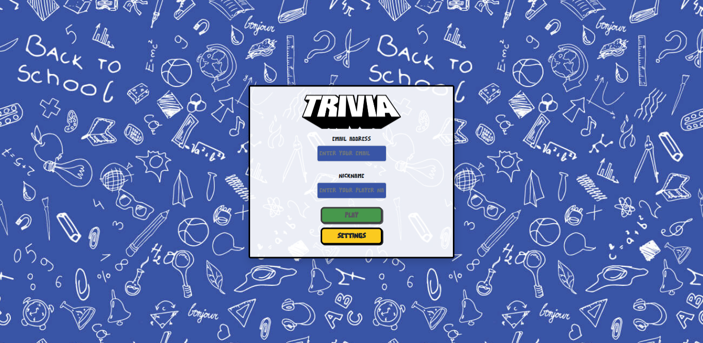
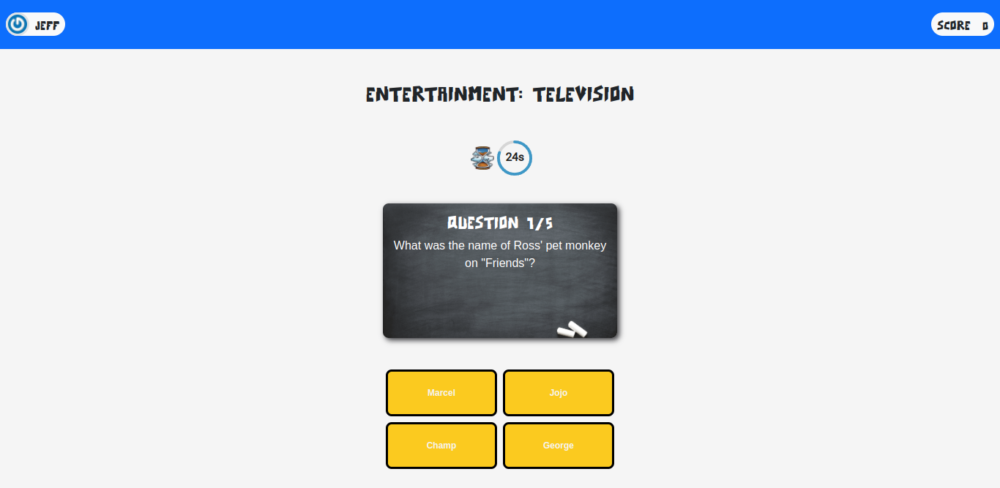
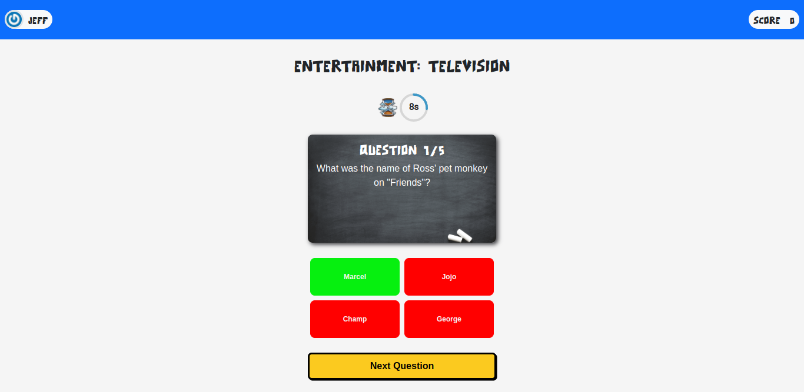
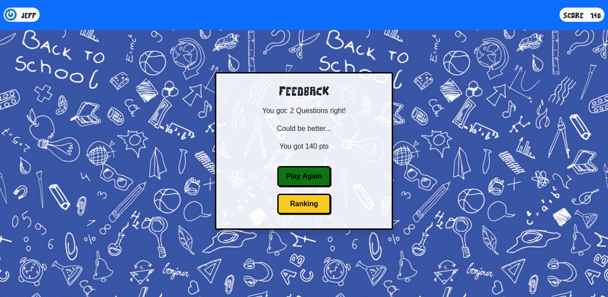
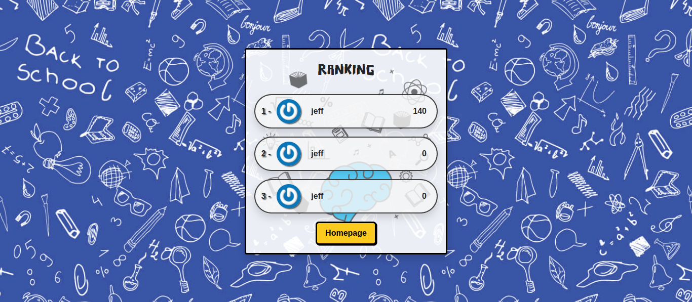

# Trivia Game

The idea of this project, is that in a group, we should create a trivia-style game, where the user can choose the difficulty and the topics of the questions, and to win he must get as many questions right.

The game has a rank system, so the user can compete with his friends to see who can get the better score.

We used ReactJS along with Redux and Hooks to distribute data and control the application's life cycle.

 

# Technologies Used

For this project the following technologies were used:

- [JavaScript](https://developer.mozilla.org/pt-BR/docs/Web/JavaScript)
- [ReactJS](https://pt-br.reactjs.org/)
- [Redux](https://redux.js.org/)
- [Docker](https://www.docker.com/)

 

## Login

 

## Home

 

## Select the question

 

## Feedback

 

## Ranking

 

## Settings

 

# How to Use:

1. Clone the repository

  ~~~bash
  git clone git@github.com:JeffThierch/Trivia-Game.git
  ~~~

2. In the root of the project change the .env_example file to .env

3. (Optional) - Change the environment variables.

4. In the root of project run the commands:

  ~~~bash
  docker-compose up --build
  ~~~

5. If everything is configured correctly, after the build process you can simply access the application.
